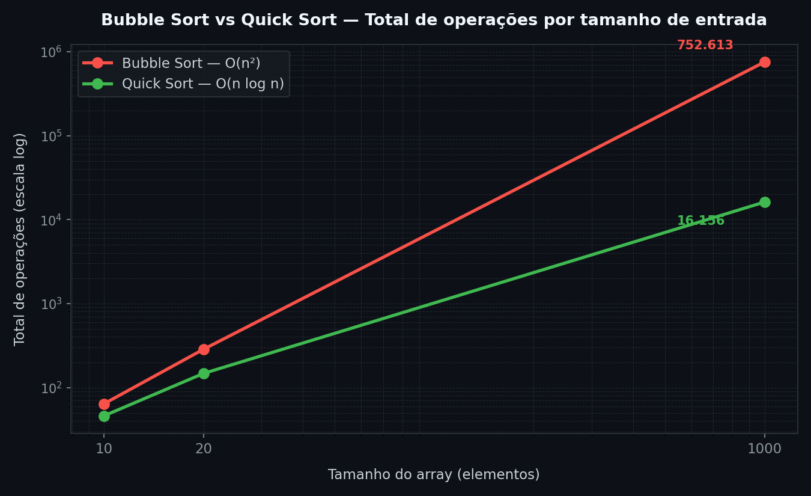

# Atividade Avaliativa — Estruturas de Dados

**Curso:** Engenharia de Software — Centro Universitário do Distrito Federal (UDF)
**Disciplina:** Estruturas de Dados
**Autores:** Danilo Tavares Lima e Pedro Artur
**Ano:** 2026
**Valor da atividade:** 1,0 ponto

## Objetivo

Investigar experimentalmente o comportamento de estruturas de dados e algoritmos fundamentais, relacionando **arrays, matrizes, ordenação, busca, índices, loops e complexidade computacional**. Além de desenvolver os códigos, a atividade exige **medir, comparar e interpretar** a quantidade de operações realizadas pelos algoritmos, evidenciando que resultados iguais podem esconder custos computacionais muito diferentes.

## Estrutura do repositório

```
project-root/
├── README.md                                  ← este arquivo
├── docs/
│   ├── 01-pesquisa-bubble-quick.md             ← Parte 1: pesquisa e comparação teórica
│   ├── 02-experimento-ordenacao.md             ← Parte 2: experimento Bubble vs Quick Sort
│   ├── 03-busca-matrizes.md                    ← Parte 3: busca sequencial em matrizes
│   ├── 04-handson1-array-temperaturas.md       ← Parte 4: Hands On 1 (array de temperaturas)
│   ├── 05-handson2-matriz-sensores.md          ← Parte 5: Hands On 2 (matriz de sensores)
│   └── 06-analise-conclusao.md                 ← Parte 6: análise crítica e conclusão
└── src/
    ├── ordenacao/
    │   ├── SortingUtils.java                   ← package ordenacao;
    │   └── Main.java                           ← package ordenacao;
    ├── busca/
    │   └── BuscaSequencial.java                ← package busca;
    ├── handson1/
    │   └── HandsOn1.java                       ← package handson1;
    └── handson2/
        └── HandsOn2.java                       ← package handson2;
```

## Sumário da entrega

| Parte | Conteúdo | Peso |
|---|---|---|
| [Parte 1](docs/01-pesquisa-bubble-quick.md) | Pesquisa e comparação entre Bubble Sort e Quick Sort | 0,20 |
| [Parte 2](docs/02-experimento-ordenacao.md) | Experimento de ordenação com arrays de 10, 20 e 1.000 elementos | 0,25 |
| [Parte 3](docs/03-busca-matrizes.md) | Busca sequencial em matrizes 2×2, 10×10 e 100×100 | 0,20 |
| [Parte 4](docs/04-handson1-array-temperaturas.md) | Hands On 1 — Investigação do array de temperaturas | 0,15 |
| [Parte 5](docs/05-handson2-matriz-sensores.md) | Hands On 2 — Matriz aplicada a sensores | 0,15 |
| [Parte 6](docs/06-analise-conclusao.md) | Análise crítica e conclusão geral | 0,05 |
| **Total** | | **1,00** |

## Como executar os códigos

Todos os programas foram desenvolvidos em **Java** e organizados em **pacotes** (uma pasta por parte). Por isso, a compilação e execução precisam ser feitas informando o pacote — não basta rodar `javac Arquivo.java` direto dentro da pasta.

A partir da **raiz do projeto**, rode:

**Ordenação (Parte 2):**
```bash
javac -d out src/ordenacao/*.java
java -cp out ordenacao.Main
```

**Busca em matrizes (Parte 3):**
```bash
javac -d out src/busca/*.java
java -cp out busca.BuscaSequencial
```
*(informe linhas, colunas e o valor buscado quando solicitado no terminal)*

**Hands On 1 (Parte 4):**
```bash
javac -d out src/handson1/*.java
java -cp out handson1.HandsOn1
```
*(informe as 10 temperaturas solicitadas)*

**Hands On 2 (Parte 5):**
```bash
javac -d out src/handson2/*.java
java -cp out handson2.HandsOn2
```
*(informe o limite de temperatura desejado)*

> `-d out` diz ao Java para colocar os arquivos compilados (`.class`) dentro de uma pasta chamada `out`, respeitando a estrutura de pacotes. `-cp out` diz para procurar essas classes dentro dessa pasta na hora de rodar. Se estiver usando o IntelliJ, basta clicar no botão ▶️ ao lado da classe desejada — a IDE já faz tudo isso por trás.

## Ideia central da atividade

> Dois algoritmos podem produzir exatamente o mesmo resultado e, ainda assim, realizar quantidades completamente diferentes de operações.

Por isso, em todos os experimentos deste repositório, buscou-se relacionar:

**Tamanho da entrada → Número de operações → Complexidade → Eficiência do algoritmo.**

## Comparação visual — crescimento das operações



*Escala logarítmica em ambos os eixos. Dados reais do experimento da [Parte 2](docs/02-experimento-ordenacao.md): com 1.000 elementos, o Bubble Sort realiza quase 47 vezes mais operações que o Quick Sort para produzir exatamente o mesmo resultado.*