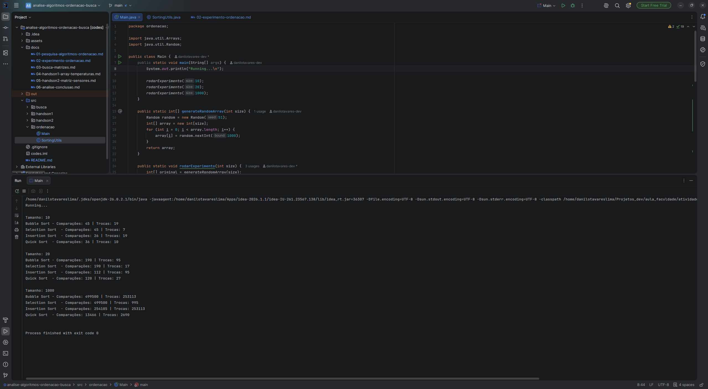

# Parte 2 — Experimento de Ordenação

[⬅ Voltar ao README principal](../README.md)

Programa desenvolvido para comparar experimentalmente Bubble Sort, Selection Sort, Insertion Sort e Quick Sort, utilizando exatamente os mesmos dados de entrada nos quatro algoritmos (uma cópia independente do array original para cada um), contabilizando comparações e trocas.

## Código

### `SortingUtils.java`

```java
package ordenacao;

public class SortingUtils {

    static int comparacoes = 0;
    static int trocas = 0;

    public static void resetCounters() {
        comparacoes = 0;
        trocas = 0;
    }

    public static void bubbleSort(int[] array) {
        for (int i = 0; i < array.length - 1; i++) {
            for (int j = 0; j < array.length - 1 - i; j++) {
                comparacoes++;
                if (array[j] > array[j + 1]) {
                    trocas++;
                    int temp = array[j];
                    array[j] = array[j + 1];
                    array[j + 1] = temp;
                }
            }
        }
    }

    public static void selectionSort(int[] array) {
        for (int i = 0; i < array.length - 1; i++) {
            int menor = i;
            for (int j = i + 1; j < array.length; j++) {
                comparacoes++;
                if (array[j] < array[menor]) {
                    menor = j;
                }
            }
            if (menor != i) {
                trocas++;
                int temp = array[i];
                array[i] = array[menor];
                array[menor] = temp;
            }
        }
    }

    public static void insertionSort(int[] array) {
        for (int i = 1; i < array.length; i++) {
            int chave = array[i];
            int j = i - 1;
            while (j >= 0) {
                comparacoes++;
                if (array[j] > chave) {
                    trocas++;
                    array[j + 1] = array[j];
                    j--;
                } else {
                    break;
                }
            }
            array[j + 1] = chave;
        }
    }

    public static void quickSort(int[] array, int low, int high) {
        int inicio = low, fim = high;
        int pivot = array[(inicio + fim) / 2];

        while (inicio <= fim) {
            while (array[inicio] < pivot) {
                comparacoes++;
                inicio++;
            }
            comparacoes++;

            while (array[fim] > pivot) {
                comparacoes++;
                fim--;
            }
            comparacoes++;

            if (inicio <= fim) {
                trocas++;
                int temp = array[inicio];
                array[inicio] = array[fim];
                array[fim] = temp;
                inicio++;
                fim--;
            }
        }

        if (fim - low > 0) quickSort(array, low, fim);
        if (high - inicio > 0) quickSort(array, inicio, high);
    }
}
```

### `Main.java`

```java
package ordenacao;

import java.util.Arrays;
import java.util.Random;

public class Main {
    public static void main(String[] args) {
        System.out.println("Running...\n");

        rodarExperimento(10);
        rodarExperimento(20);
        rodarExperimento(1000);
    }

    public static int[] generateRandomArray(int size) {
        Random random = new Random(51);
        int[] array = new int[size];
        for (int i = 0; i < array.length; i++) {
            array[i] = random.nextInt(1000);
        }
        return array;
    }

    public static void rodarExperimento(int size) {
        int[] original = generateRandomArray(size);

        // Bubble Sort
        int[] paraBubble = Arrays.copyOf(original, original.length);
        SortingUtils.resetCounters();
        SortingUtils.bubbleSort(paraBubble);
        int comparacoesBubble = SortingUtils.comparacoes;
        int trocasBubble = SortingUtils.trocas;

        // Selection Sort
        int[] paraSelection = Arrays.copyOf(original, original.length);
        SortingUtils.resetCounters();
        SortingUtils.selectionSort(paraSelection);
        int comparacoesSelection = SortingUtils.comparacoes;
        int trocasSelection = SortingUtils.trocas;

        // Insertion Sort
        int[] paraInsertion = Arrays.copyOf(original, original.length);
        SortingUtils.resetCounters();
        SortingUtils.insertionSort(paraInsertion);
        int comparacoesInsertion = SortingUtils.comparacoes;
        int trocasInsertion = SortingUtils.trocas;

        // Quick Sort
        int[] paraQuick = Arrays.copyOf(original, original.length);
        SortingUtils.resetCounters();
        SortingUtils.quickSort(paraQuick, 0, paraQuick.length - 1);
        int comparacoesQuick = SortingUtils.comparacoes;
        int trocasQuick = SortingUtils.trocas;

        System.out.println("Tamanho: " + size);
        System.out.println("Bubble Sort - Comparações: " + comparacoesBubble + " | Trocas: " + trocasBubble);
        System.out.println("Selection Sort  - Comparações: " + comparacoesSelection + " | Trocas: " + trocasSelection);
        System.out.println("Insertion Sort  - Comparações: " + comparacoesInsertion + " | Trocas: " + trocasInsertion);
        System.out.println("Quick Sort  - Comparações: " + comparacoesQuick + " | Trocas: " + trocasQuick);
        System.out.println();
    }
}
```

> Os quatro algoritmos usam a mesma semente aleatória (`Random(51)`) e operam sobre cópias independentes (`Arrays.copyOf`) do mesmo array original, garantindo que a comparação seja justa.

## Execução do programa



## Resultados obtidos

| Tamanho do Array | Bubble – Comparações | Bubble – Trocas | Selection – Comparações | Selection – Trocas | Insertion – Comparações | Insertion – Trocas | Quick – Comparações | Quick – Trocas |
|---|---|---|---|---|---|---|---|---|
| 10 | 45 | 19 | 45 | 7 | 26 | 19 | 36 | 10 |
| 20 | 190 | 95 | 190 | 17 | 112 | 95 | 120 | 27 |
| 1.000 | 499.500 | 253.113 | 499.500 | 995 | 254.105 | 253.113 | 13.466 | 2.690 |

**Total de operações (comparações + trocas) por algoritmo:**

| Tamanho do Array | Bubble Sort | Selection Sort | Insertion Sort | Quick Sort |
|---|---|---|---|---|
| 10 | 64 | 52 | **45** | 46 |
| 20 | 285 | 207 | 207 | **147** |
| 1.000 | 752.613 | 500.495 | 507.218 | **16.156** |

## Respostas

**a) Qual algoritmo realizou menos operações para 10 elementos?**

Surpreendentemente, foi o **Insertion Sort**, com apenas 45 operações no total (26 comparações + 19 trocas) — ligeiramente menos até que o Quick Sort, que fez 46 (36 comparações + 10 trocas). Isso ilustra um fenômeno real e conhecido na prática: para entradas muito pequenas, o overhead da recursão e do particionamento do Quick Sort pode custar mais do que os poucos deslocamentos que o Insertion Sort precisa fazer. É justamente por isso que implementações otimizadas de ordenação (como o Timsort e diversas bibliotecas padrão) usam Insertion Sort internamente para ordenar sub-partições pequenas dentro de algoritmos híbridos.

**b) O comportamento permaneceu igual para 20 elementos?**

Não completamente. Com 20 elementos, o Quick Sort já assume a liderança de forma clara, com 147 operações (120 comparações + 27 trocas), contra 207 do Insertion Sort e do Selection Sort (que, coincidentemente, empatam no total, ainda que distribuam comparações e trocas de forma bem diferente) e 285 do Bubble Sort. Ou seja, a vantagem do Insertion Sort observada em (a) já desaparece rapidamente conforme o tamanho da entrada cresce.

**c) O que aconteceu quando o tamanho aumentou para 1.000 elementos?**

A diferença se tornou drástica entre os algoritmos O(n²) e o Quick Sort. Bubble Sort (752.613), Selection Sort (500.495) e Insertion Sort (507.218) ficaram na mesma ordem de grandeza entre si, enquanto o Quick Sort fez apenas 16.156 operações — quase 47 vezes menos que o Bubble Sort. Um detalhe interessante nos números: as **trocas do Bubble Sort (253.113) e os deslocamentos do Insertion Sort (253.113) são exatamente iguais**. Isso não é coincidência — ambos os valores correspondem ao número de **inversões** do array original (pares fora de ordem), uma propriedade matemática conhecida desses dois algoritmos. Já o Selection Sort, mesmo sendo O(n²) como os outros dois, faz apenas 995 trocas — muito menos que os outros —, porque ele nunca troca mais de uma vez por posição, não importa quantos elementos estejam fora de ordem.

**d) Qual algoritmo apresentou maior crescimento da quantidade de operações?**

O Bubble Sort teve o maior crescimento em número absoluto de operações (64 → 285 → 752.613), mas o Selection Sort (52 → 207 → 500.495) e o Insertion Sort (45 → 207 → 507.218) cresceram na mesma ordem de grandeza, todos característicos de O(n²). O Quick Sort, por sua vez, cresceu de forma muito mais suave (46 → 147 → 16.156), refletindo sua complexidade O(n log n).

**e) Os resultados experimentais são coerentes com as complexidades teóricas estudadas?**

Sim. Um dado revelador: as comparações do Bubble Sort e do Selection Sort são **idênticas em todos os tamanhos testados** (45, 190 e 499.500). Isso acontece porque nenhuma das duas implementações usadas aqui tem otimização de parada antecipada — ambas sempre executam exatamente `n·(n-1)/2` comparações, independentemente de o array já estar ordenado ou não, o que é a própria definição de O(n²) no melhor, médio e pior caso. Já o Insertion Sort faz menos comparações (254.105 para n=1.000) porque se beneficia parcialmente da ordem dos dados já processados, mesmo em uma entrada aleatória — ainda assim, seu crescimento continua sendo quadrático. O Quick Sort, com apenas 13.466 comparações para o mesmo tamanho, confirma experimentalmente o comportamento O(n log n): o crescimento das comparações, de 36 para 13.466 (100x o tamanho da entrada), é ordens de magnitude mais lento do que o crescimento quadrático dos outros três algoritmos.

**f) Em qual situação você escolheria Bubble Sort? E Selection Sort? E Insertion Sort?**

- **Bubble Sort:** principalmente em contextos didáticos, pela simplicidade de implementação. Na prática, o Selection Sort e o Insertion Sort quase sempre o superam com a mesma complexidade O(n²).
- **Selection Sort:** quando o custo de cada troca/escrita é muito mais caro que uma comparação — como, por exemplo, ao ordenar dados em uma memória com custo de escrita elevado —, já que ele garante o menor número possível de trocas.
- **Insertion Sort:** para arrays pequenos, dados já quase ordenados, ou em cenários de ordenação *online* (dados chegando progressivamente), onde seu comportamento adaptativo o torna, na prática, competitivo até com o Quick Sort, como visto no item (a).

**g) Em qual situação você escolheria Quick Sort?**

Em praticamente qualquer cenário de uso real com conjuntos de dados médios ou grandes, onde performance é importante. É a escolha adequada quando não há restrição de estabilidade na ordenação, e quando se pode usar uma boa estratégia de pivô para evitar o pior caso O(n²), como a utilizada neste experimento (pivô no meio do intervalo), que já ajuda a evitar esse problema em arrays já ordenados.

---

[➡ Próxima parte: Parte 3 — Busca em Matrizes](03-busca-matrizes.md)