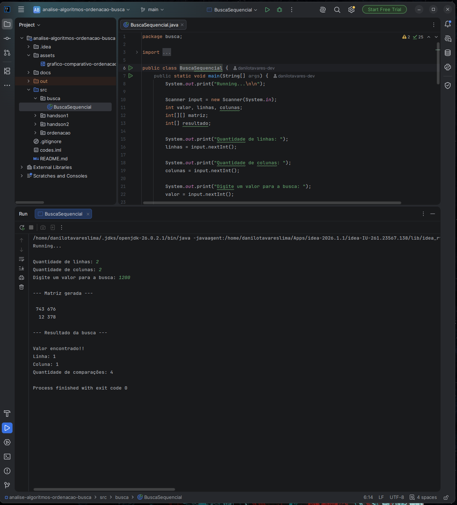
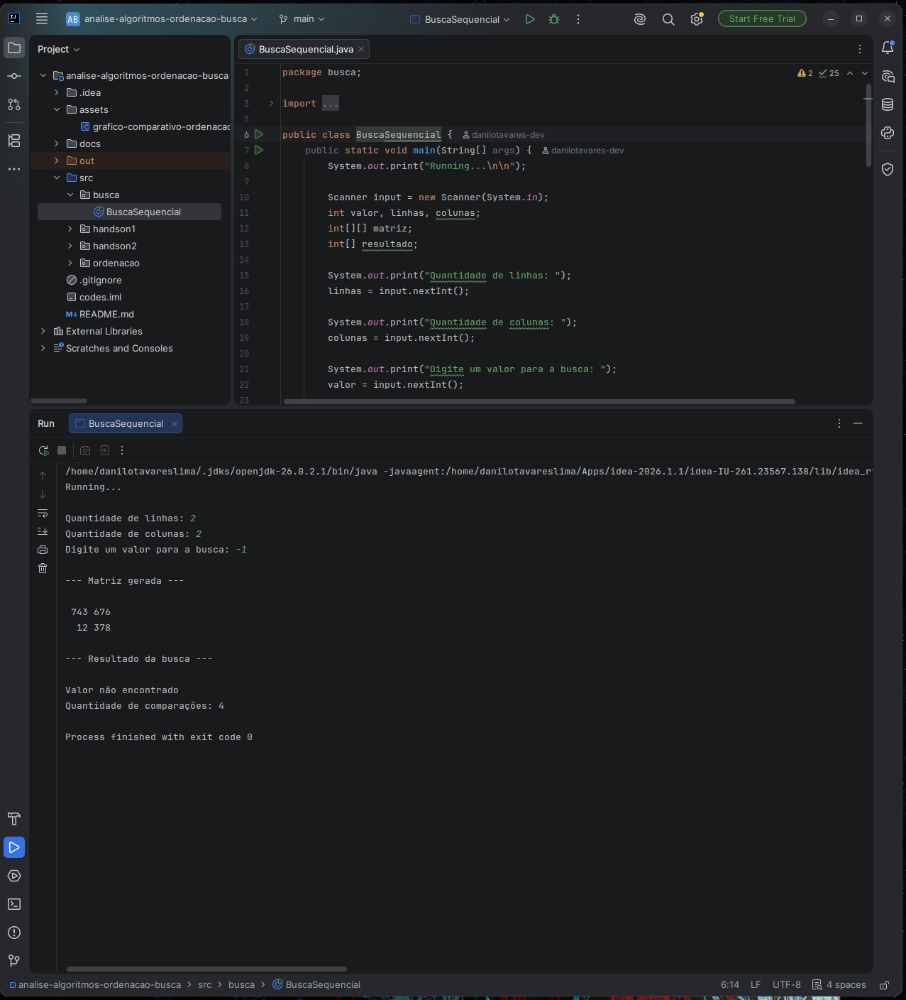
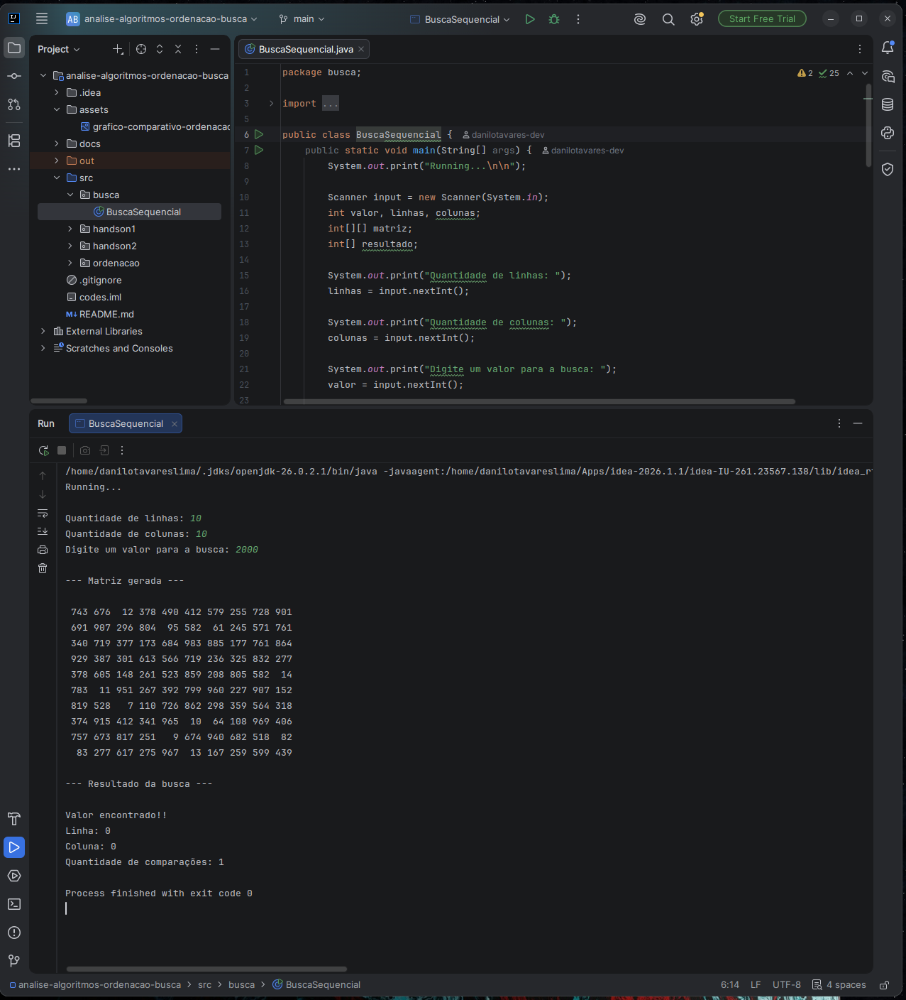
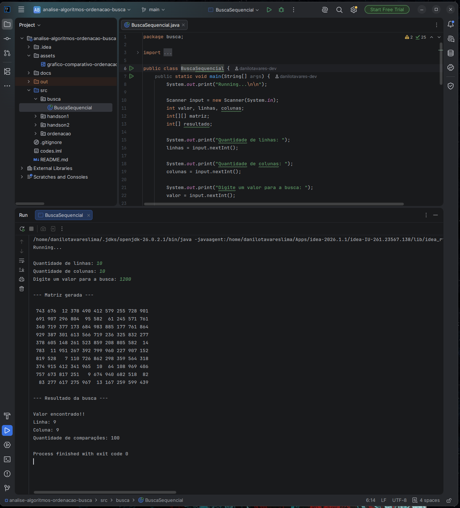
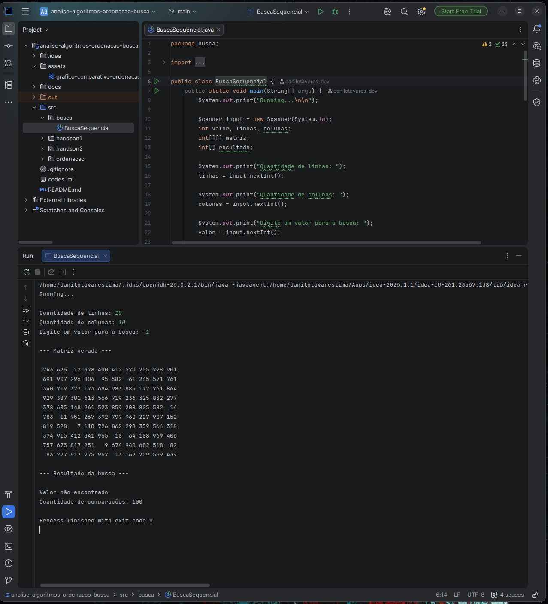
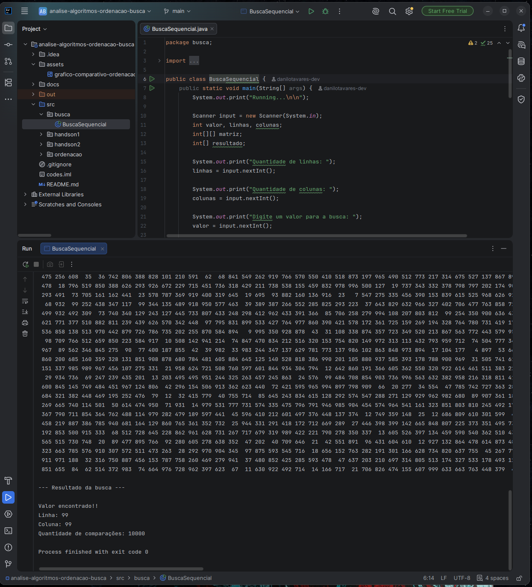
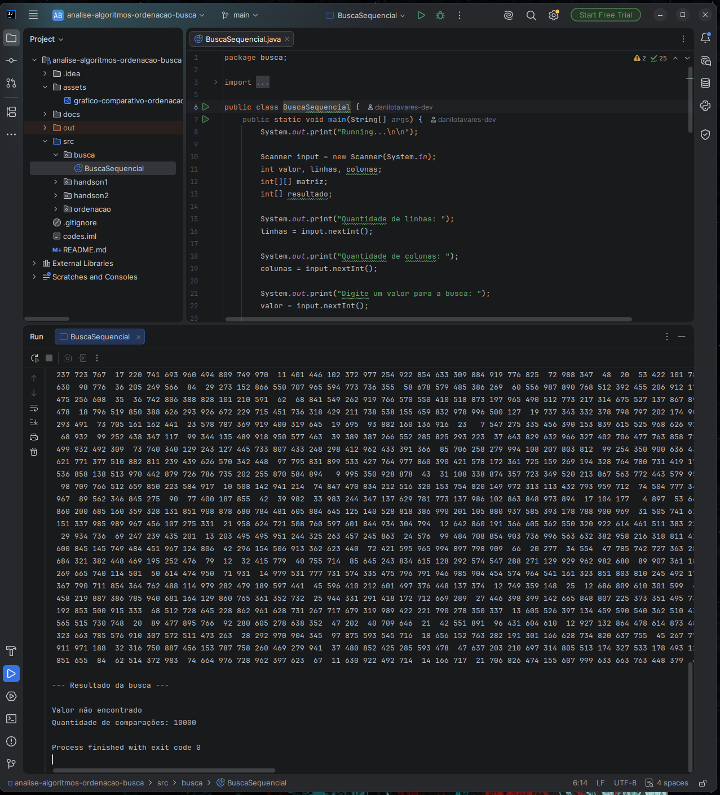

# Parte 3 — Investigação de Busca em Matrizes

[⬅ Voltar ao README principal](../README.md)

Algoritmo de busca sequencial em matriz utilizando loops aninhados, que informa se o valor foi encontrado, a linha e coluna correspondentes, e a quantidade de comparações realizadas.

## Código — `busca.BuscaSequencial.java`

```java
import java.util.Random;
import java.util.Scanner;

public class busca.BuscaSequencial {
    public static void main(String[] args) {
        System.out.print("Running...\n\n");
        Scanner input = new Scanner(System.in);
        int valor, linhas, colunas;
        int[][] matriz;
        int[] resultado;

        System.out.print("Quantidade de linhas: ");
        linhas = input.nextInt();
        System.out.print("Quantidade de colunas: ");
        colunas = input.nextInt();
        System.out.print("Digite um valor para a busca: ");
        valor = input.nextInt();

        matriz = gerarMatrizAleatoria(linhas, colunas);

        System.out.println("\n--- Matriz gerada --- \n");
        for (int i = 0; i < linhas; i++) {
            for (int j = 0; j < colunas; j++) {
                System.out.printf("%4d", matriz[i][j]);
            }
            System.out.println();
        }

        matriz[0][0] = 2000;                          // valor conhecido no início
        matriz[linhas - 1][colunas - 1] = 1200;        // valor conhecido no final

        resultado = buscaValor(valor, matriz, linhas, colunas);

        System.out.println("\n--- Resultado da busca --- \n");
        if (resultado[0] == 1) {
            System.out.println("Valor encontrado!!");
            System.out.println("Linha: " + resultado[1]);
            System.out.println("Coluna: " + resultado[2]);
            System.out.println("Quantidade de comparações: " + resultado[3]);
        } else {
            System.out.println("Valor não encontrado");
            System.out.println("Quantidade de comparações: " + resultado[3]);
        }
    }

    public static int[][] gerarMatrizAleatoria(int qtdLinhas, int qtdColunas) {
        Random random = new Random(51);
        int[][] matriz = new int[qtdLinhas][qtdColunas];
        for (int i = 0; i < qtdLinhas; i++) {
            for (int j = 0; j < qtdColunas; j++) {
                matriz[i][j] = random.nextInt(1000);
            }
        }
        return matriz;
    }

    public static int[] buscaValor(int valor, int[][] matriz, int linhas, int colunas) {
        int comparacoes = 0;
        for (int i = 0; i < linhas; i++) {
            for (int j = 0; j < colunas; j++) {
                comparacoes++;
                if (matriz[i][j] == valor) {
                    return new int[] {1, i, j, comparacoes};
                }
            }
        }
        return new int[] {0, -1, -1, comparacoes};
    }
}
```

> Para garantir a existência de valores conhecidos, o programa sobrescreve deliberadamente a primeira posição `[0][0]` com `2000` e a última posição `[linhas-1][colunas-1]` com `1200`, permitindo testar buscas no início e no final de forma controlada.

## Testes realizados

Para cada tamanho de matriz (2×2, 10×10 e 100×100), foram testadas três situações: valor no início, valor no final e valor inexistente.

## Testes realizados

Para cada tamanho de matriz (2×2, 10×10 e 100×100), foram testadas três situações: valor no início, valor no final e valor inexistente.

### Matriz 2×2

**Valor no início (`2000`):**


**Valor no final (`1200`):**



**Valor inexistente (`-1`):**



### Matriz 10×10

**Valor no início (`2000`):**



**Valor no final (`1200`):**



**Valor inexistente (`-1`):**



### Matriz 100×100

**Valor no início (`2000`):**


**Valor no final (`1200`):**



**Valor inexistente:**



## Tabela de registros

| Matriz | Nº de elementos | Busca no início | Busca no final | Valor inexistente |
|---|---|---|---|---|
| 2×2 | 4 | 1 | 4 | 4 |
| 10×10 | 100 | 1 | 100 | 100 |
| 100×100 | 10.000 | 1 | 10.000 | 10.000 |

## Respostas

**a) Por que encontrar um elemento no início exige menos operações?**

Porque a busca sequencial percorre a matriz de forma linear, começando em `[0][0]` e avançando posição por posição (linha por linha, coluna por coluna). Se o valor procurado está logo na primeira posição verificada, o algoritmo encontra ele imediatamente e pode parar, sem precisar checar o restante das posições. Por isso, uma busca no início tende a ter o menor número possível de comparações, no caso ideal, apenas 1.

**b) O que acontece quando o elemento procurado não existe?**

O algoritmo é obrigado a percorrer a matriz inteira, checando todas as posições, uma por uma, sem nunca encontrar uma correspondência. Como não há como o algoritmo "saber" antecipadamente que o valor não existe, ele só pode concluir isso depois de verificar a última posição. Isso confirma exatamente o resultado obtido no teste: buscando um valor inexistente numa matriz 100×100, o resultado foi "Valor não encontrado" com exatamente 10.000 comparações, o total de elementos da matriz (100 × 100 = 10.000).

**c) Qual é o pior caso da busca sequencial?**

O pior caso acontece em duas situações equivalentes em termos de operações: quando o valor procurado está na última posição da matriz, ou quando o valor não existe na matriz. Em ambos os casos, o algoritmo precisa percorrer todas as m × n posições antes de parar (seja porque encontrou no fim, seja porque esgotou a busca sem sucesso). O teste com o valor inexistente na matriz 100×100 ilustra exatamente esse pior caso.

**d) Como o aumento das dimensões da matriz influencia a quantidade de operações?**

O número de operações no pior caso cresce proporcionalmente ao número total de elementos da matriz, que é o produto de linhas por colunas (m × n). Por exemplo, uma matriz 2×2 tem 4 elementos, uma 10×10 tem 100, e uma 100×100 tem 10.000. Ou seja, ao aumentar as dimensões, o número máximo de comparações cresce na mesma proporção do aumento da área da matriz, não das dimensões individuais. Dobrar apenas o número de linhas, por exemplo, dobra o número de operações no pior caso, mas dobrar linhas e colunas ao mesmo tempo multiplica o número de operações por quatro.

**e) Qual a complexidade da busca sequencial em uma matriz com m linhas e n colunas?**

A complexidade é **O(m × n)**. Isso porque, no pior caso, o algoritmo precisa visitar cada uma das m × n posições da matriz exatamente uma vez, através dos dois loops aninhados (um percorrendo as m linhas, outro percorrendo as n colunas dentro de cada linha). Essa é a mesma lógica de complexidade já observada no Bubble Sort e Quick Sort, só que aqui aplicada a uma estrutura bidimensional em vez de um array simples.

---

[➡ Próxima parte: Parte 4 — Hands On 1 (Array de Temperaturas)](04-handson1-array-temperaturas.md)