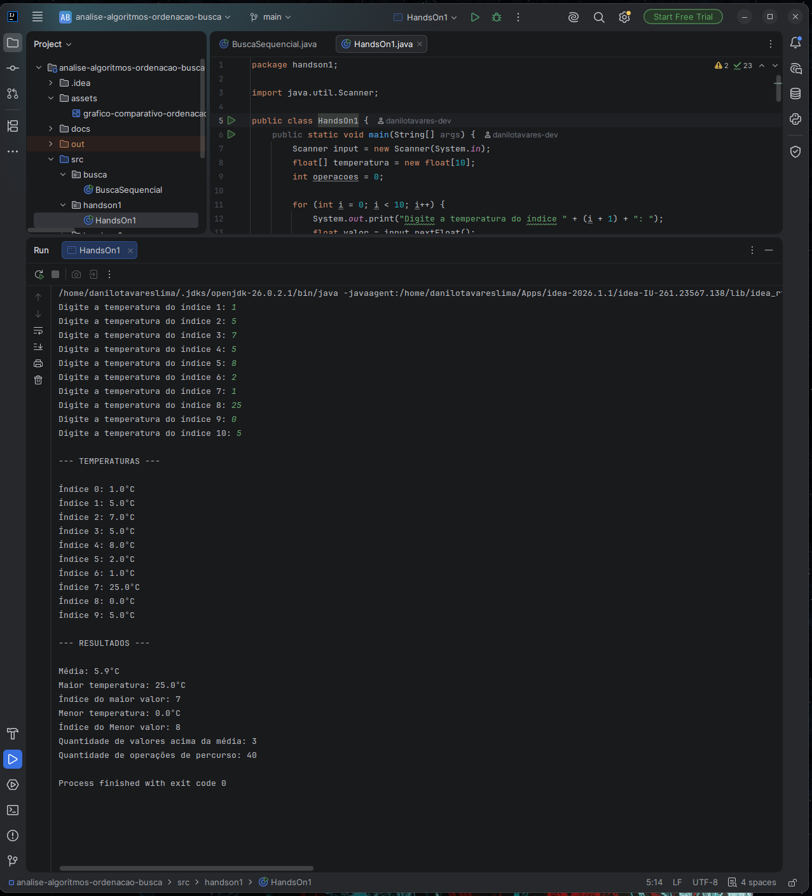

# Parte 4 — Hands On 1: Investigação do Array

[⬅ Voltar ao README principal](../README.md)

Programa que armazena 10 temperaturas em um array (`float temperatura[10]`), exibe todos os valores, calcula a média, identifica o maior e o menor valor (com seus índices) e conta quantos valores estão acima da média.

## Código — `handson1.HandsOn1.java`

```java
import java.util.Scanner;

public class handson1.HandsOn1 {
    public static void main(String[] args) {
        Scanner input = new Scanner(System.in);
        float[] temperatura = new float[10];
        int operacoes = 0;

        for (int i = 0; i < 10; i++) {
            System.out.print("Digite a temperatura do índice " + (i + 1) + ": ");
            float valor = input.nextFloat();
            temperatura[i] = valor;
            operacoes++;
        }

        System.out.println("\n--- TEMPERATURAS ---\n");
        for (int i = 0; i < 10; i++) {
            System.out.println("Índice " + i + ": " + temperatura[i] + "ºC");
            operacoes++;
        }

        float soma = 0;
        float maior = temperatura[0];
        float menor = temperatura[0];
        int indiceMaior = 0;
        int indiceMenor = 0;

        for (int i = 0; i < 10; i++) {
            soma += temperatura[i];
            operacoes++;
            if (temperatura[i] > maior) {
                maior = temperatura[i];
                indiceMaior = i;
            }
            if (temperatura[i] < menor) {
                menor = temperatura[i];
                indiceMenor = i;
            }
        }

        float media = soma / 10.0f;
        int acimaMedia = 0;

        for (int i = 0; i < 10; i++) {
            operacoes++;
            if (temperatura[i] > media) {
                acimaMedia += 1;
            }
        }

        System.out.println("\n--- RESULTADOS ---\n");
        System.out.println("Média: " + media + "ºC ");
        System.out.println("Maior temperatura: " + maior + "ºC");
        System.out.println("Índice do maior valor: " + indiceMaior);
        System.out.println("Menor temperatura: " + menor + "ºC");
        System.out.println("Índice do Menor valor: " + indiceMenor);
        System.out.println("Quantidade de valores acima da média: " + acimaMedia);
        System.out.println("Quantidade de operações de percurso: " + operacoes);
    }
}
```

## Execução do programa




## Análise de complexidade

O algoritmo percorre o array de temperaturas quatro vezes de forma sequencial: uma vez para a leitura dos valores digitados pelo usuário, uma vez para exibir todos os elementos, uma vez para calcular a soma, identificar o maior e o menor valor simultaneamente, e uma última vez para contar quantos valores estão acima da média. Como o array tem exatamente 10 posições, e cada um desses quatro percursos realiza uma iteração por posição, o total de operações de percurso é de aproximadamente **40** (4 loops × 10 iterações cada) — número confirmado pela saída do programa.

Em termos de complexidade, cada um desses loops individuais é **O(n)**, já que percorre o array uma única vez, sem loops aninhados. Como os quatro loops acontecem em sequência (um depois do outro, não um dentro do outro), a complexidade total do algoritmo continua sendo **O(n)**, e não O(n²) ou algo maior. Isso acontece porque, na notação Big O, constantes multiplicativas são descartadas: mesmo que o algoritmo faça "4n" operações no total, o comportamento assintótico dele ainda cresce linearmente conforme o tamanho da entrada aumenta, por isso simplificamos para O(n).

Isso poderia ser otimizado unindo os quatro loops em um único percurso, reduzindo o número de operações de 4n para aproximadamente 2n (uma passagem para leitura/exibição combinadas, e outra para soma/maior/menor, já que a contagem acima da média depende da média já calculada, que só existe depois do primeiro percurso completo). Ainda assim, a complexidade continuaria sendo O(n), só que com uma constante menor.

---

[➡ Próxima parte: Parte 5 — Hands On 2 (Matriz de Sensores)](05-handson2-matriz-sensores.md)