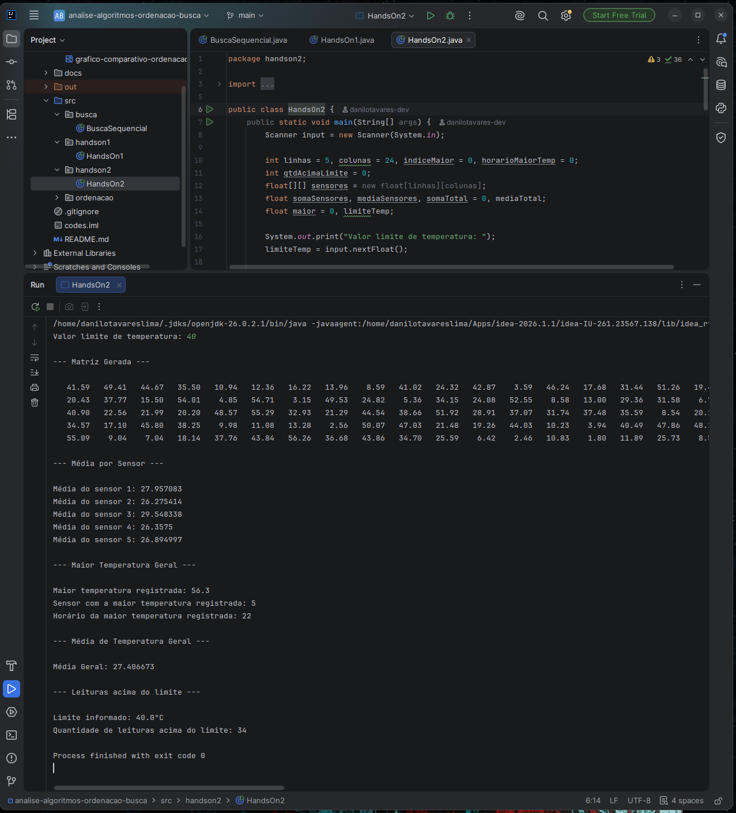

# Parte 5 — Hands On 2: Matriz Aplicada — Monitoramento de Sensores

[⬅ Voltar ao README principal](../README.md)

Sistema com 5 sensores de temperatura e 24 medições por sensor (`float sensores[5][24]`), onde cada linha representa um sensor e cada coluna representa um horário (0 a 23). O programa calcula a média por sensor, a maior temperatura geral (com sensor e horário de ocorrência), a média geral e a quantidade de leituras acima de um limite informado pelo usuário.

## Código — `handson2.HandsOn2.java`

```java
import java.util.Random;
import java.util.Scanner;

public class handson2.HandsOn2 {
    public static void main(String[] args) {
        Scanner input = new Scanner(System.in);
        int linhas = 5, colunas = 24, indiceMaior = 0, horarioMaiorTemp = 0;
        int qtdAcimaLimite = 0;
        float[][] sensores = new float[linhas][colunas];
        float somaSensores, mediaSensores, somaTotal = 0, mediaTotal;
        float maior = 0, limiteTemp;

        System.out.print("Valor limite de temperatura: ");
        limiteTemp = input.nextFloat();

        sensores = gerarMatrizAleatoria(linhas, colunas);

        System.out.println("\n--- Matriz Gerada --- \n");
        for (int i = 0; i < linhas; i++) {
            for (int j = 0; j < colunas; j++) {
                System.out.printf("%8.2f", sensores[i][j]);
            }
            System.out.println();
        }

        System.out.println("\n--- Média por Sensor --- \n");
        for (int i = 0; i < linhas; i++) {
            somaSensores = 0;
            for (int j = 0; j < colunas; j++) {
                if (sensores[i][j] > limiteTemp)
                    qtdAcimaLimite++;
                if (sensores[i][j] > maior) {
                    maior = sensores[i][j];
                    indiceMaior = i + 1;
                    horarioMaiorTemp = j;
                }
                somaSensores += sensores[i][j];
                somaTotal += sensores[i][j];
            }
            mediaSensores = somaSensores / colunas;
            System.out.println("Média do sensor " + (i + 1) + ": " + mediaSensores);
        }

        mediaTotal = somaTotal / (linhas * colunas);

        System.out.println("\n--- Maior Temperatura Geral --- \n");
        System.out.println("Maior temperatura registrada: " + maior);
        System.out.println("Sensor com a maior temperatura registrada: " + indiceMaior);
        System.out.println("Horário da maior temperatura registrada: " + horarioMaiorTemp);

        System.out.println("\n--- Média de Temperatura Geral --- \n");
        System.out.println("Média Geral: " + mediaTotal);

        System.out.println("\n--- Leituras acima do limite --- \n");
        System.out.println("Limite informado: " + limiteTemp + "°C");
        System.out.println("Quantidade de leituras acima do limite: " + qtdAcimaLimite);
    }

    public static float[][] gerarMatrizAleatoria(int qtdLinhas, int qtdColunas) {
        Random random = new Random(51);
        float[][] matriz = new float[qtdLinhas][qtdColunas];
        for (int i = 0; i < qtdLinhas; i++) {
            for (int j = 0; j < qtdColunas; j++) {
                matriz[i][j] = Math.round(random.nextFloat(57) * 100) / 100.0f;
            }
        }
        return matriz;
    }
}
```

## Execução do programa




## Explicações

### Por que são necessários loops aninhados?

A matriz de sensores é uma estrutura bidimensional, com 5 linhas (sensores) e 24 colunas (horários). Para acessar cada uma das 120 medições individuais, é necessário percorrer as duas dimensões simultaneamente: primeiro fixar um sensor específico, depois percorrer todos os horários daquele sensor, um por um. Um único loop não seria suficiente, porque ele só consegue avançar em uma dimensão de cada vez. O loop externo controla em qual sensor (linha) estamos, e o loop interno controla em qual horário (coluna) daquele sensor estamos, e é essa combinação dos dois que garante que toda posição da matriz seja visitada.

### Qual o papel dos índices [i][j]?

O índice `i` representa o sensor sendo analisado no momento (variando de 0 a 4, correspondendo aos 5 sensores), e o índice `j` representa o horário sendo analisado dentro daquele sensor (variando de 0 a 23, correspondendo às 24 horas do dia). Juntos, `sensores[i][j]` aponta para exatamente uma medição específica: a temperatura registrada por um sensor determinado, em um horário determinado. É através dessa combinação de índices que o programa consegue, por exemplo, informar não apenas qual foi a maior temperatura registrada, mas também qual sensor a registrou (usando `i`) e em qual horário isso aconteceu (usando `j`).

### Quantas posições da matriz são percorridas?

Como a matriz tem 5 linhas e 24 colunas, o total de posições percorridas é de **5 × 24 = 120 posições**, correspondendo exatamente às 120 medições do sistema (5 sensores × 24 horas cada). Cada uma dessas 120 posições é visitada exatamente uma vez durante o percurso completo dos loops aninhados, seja para calcular a soma, comparar com o maior valor, ou verificar se está acima do limite informado.

### Qual a relação entre o número de linhas, colunas e quantidade de operações?

A quantidade de operações necessárias para percorrer a matriz inteira é diretamente proporcional ao produto entre o número de linhas e o número de colunas, ou seja, complexidade **O(linhas × colunas)**. Isso significa que, se o número de sensores dobrasse (de 5 para 10, mantendo 24 horários cada), a quantidade de operações também dobraria (de 120 para 240). Da mesma forma, se o número de medições por sensor aumentasse (de 24 para 48 horários, por exemplo), a quantidade de operações também dobraria. O crescimento não depende apenas de uma dimensão isoladamente, mas do produto das duas, o que caracteriza a complexidade O(m × n) de algoritmos que precisam visitar cada célula de uma estrutura bidimensional pelo menos uma vez — exatamente a mesma lógica de complexidade já observada na busca sequencial da [Parte 3](03-busca-matrizes.md).

---

[➡ Próxima parte: Parte 6 — Análise e Conclusão](06-analise-conclusao.md)